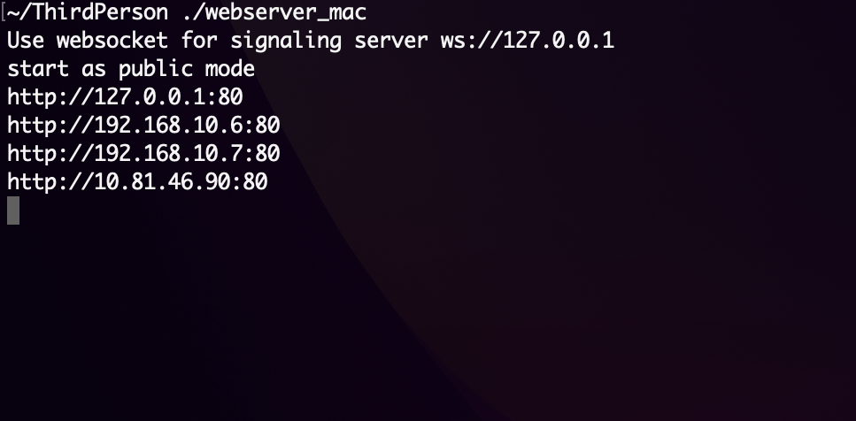

# Proyecto streaming de Holograma con Kinects

## 1. Obtención de Point Clouds con LiveScan

se uso [LiveScan3D](https://github.com/MarekKowalski/LiveScan3D) para obtener los poin clouds, para este proceso se tuvo que calibrar como indica la documentación, se uso la estrategia de usar un cubo con medidas de 20cm.

Para la Calibración se usaron los siguientes marcadores 

## 2. Streaming de Point Clouds a Unity 

Modificamos el [repositorio original](https://github.com/MarekKowalski/LiveScan3D-Hololens) quitando todo lo relacionado a Hololens y eliminar errores con sus dependencias. publicando un nuevo [repositorio](https://github.com/Misash/LiveScan3D-Unity-) con estas modificaciones.

## 3. Streaming de Point Clouds de Manera Local 

Para realizar el streaming de manera local, usamos [Unity Render Streaming](https://github.com/Unity-Technologies/UnityRenderStreaming/blob/main/com.unity.renderstreaming/Documentation~/tutorial.md) donde creamos un compilado de nuestro servidor en NodeJs para enviar los Point Clouds por web-sockets.

El servidor se ejecutara en el puerto 80.

https://github.com/6162636465/Holograma-con-kinect/assets/70419764/9dd124be-6dc7-47c9-989e-023d6a013add

## 4. Streaming de Point Clouds a Internet en multiples dispositivos 

